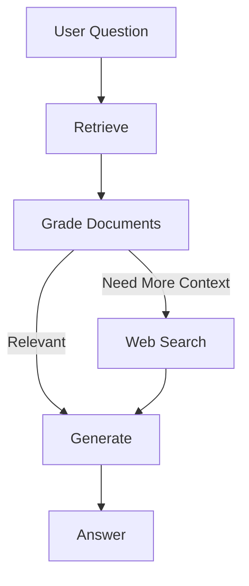

# 🤖 Agentic RAG with LangGraph

> An intelligent Retrieval-Augmented Generation (RAG) system built using **LangGraph**, **LangChain**, **Ollama**, **ChromaDB**, and **Tavily Search**.

<p align="center">


</p>

---

## 🚀 Overview

This project implements an **Agentic RAG workflow** where an AI agent decides whether the retrieved documents are sufficient or if it should search the web before generating the final response.

Instead of blindly answering from retrieved context, the agent **reasons** about document relevance, making responses more accurate and reliable.

---

# 🏗 Architecture

```text
                    👤 User Question
                           │
                           ▼
                 🔍 Retrieve Documents
                           │
                           ▼
            📝 Grade Document Relevance
                  │                 │
         ✅ Relevant          ❌ Irrelevant
                  │                 │
                  │          🌐 Web Search
                  │                 │
                  └─────────┬───────┘
                            ▼
                     🤖 Generate Answer
                            │
                            ▼
                           🎯 Response
```

---

# ✨ Features

- 📄 Retrieval-Augmented Generation
- 🤖 Agentic Decision Making
- 🧠 LLM-based Document Grading
- 🌐 Automatic Web Search Fallback
- 📚 Persistent Chroma Vector Database
- ⚡ Local LLM using Ollama
- 🧩 Modular LangGraph Workflow
- 📦 Structured Outputs using Pydantic

---

# 🛠 Tech Stack

| Technology | Purpose |
|------------|----------|
| 🐍 Python | Programming Language |
| 🦜 LangChain | LLM Framework |
| 🔀 LangGraph | Agent Workflow |
| 🦙 Ollama | Local LLM Inference |
| 🧠 GPT-OSS 20B | Generation & Grading |
| 📚 ChromaDB | Vector Database |
| 🔎 Nomic Embed | Embedding Model |
| 🌐 Tavily | Web Search |
| 📑 Unstructured | Document Loader |
| 🧪 Pytest | Testing |

---

# 📂 Project Structure

```text
agentic-rag/
│
├── graph/
│   ├── chains/
│   │   ├── generation.py
│   │   └── retrieval_grader.py
│   │
│   ├── nodes/
│   │   ├── retrieve.py
│   │   ├── grade_documents.py
│   │   ├── web_search.py
│   │   └── generate.py
│   │
│   ├── graph.py
│   ├── state.py
│   └── consts.py
│
├── ingestion.py
├── main.py
├── .env
└── README.md
```

---

# ⚙ Workflow

## 🔍 Step 1 — Retrieve

Searches the Chroma vector database for semantically similar documents.

---

## 📝 Step 2 — Grade

Each document is evaluated by the LLM.

```text
Question
      │
      ▼
Document
      │
      ▼
LLM Grader
      │
 ┌────┴────┐
 │         │
YES       NO
 │         │
 ▼         ▼
Keep    Discard
```

---

## 🌐 Step 3 — Web Search

If retrieved knowledge is insufficient, the agent automatically searches the web using Tavily.

---

## 🤖 Step 4 — Generate

The final answer is generated using:

- Relevant Documents
- Web Results (if needed)

---

# 🔄 LangGraph Workflow



---

# 🧠 State

```python
class GraphState(TypedDict):

    question: str

    documents: List[Document]

    web_search: bool

    generation: str
```

---

# 📦 Installation

Clone the repository.

```bash
git clone https://github.com/<your-username>/agentic-rag.git
```

Create virtual environment.

```bash
uv venv
```

Install dependencies.

```bash
uv sync
```

---

# 🤖 Ollama Setup

Pull required models.

```bash
ollama pull gpt-oss:20b

ollama pull nomic-embed-text
```

Start Ollama.

```bash
ollama serve
```

---

# 🔑 Environment Variables

Create a `.env` file.

```text
TAVILY_API_KEY=xxxxxxxxxxxxxxxx
```

---

# 📚 Build the Vector Store

```bash
python ingestion.py
```

---

# ▶ Run

```bash
python main.py
```

Example

```text
Hello Advanced RAG

Retrieving documents...

Checking document relevance...

Generate Answer...

Done ✅
```

---

# 🧪 Tests

```bash
pytest
```

---

# 📖 Knowledge Base

The vector database is created from Lilian Weng's excellent articles:

- 🤖 LLM Powered Autonomous Agents
- 📝 Prompt Engineering
- 🛡 Adversarial Attacks on LLMs

---

# 🚀 Future Improvements

- ✅ Query Rewriting
- ✅ Hallucination Detection
- ✅ Answer Grading
- ✅ Reflection Agents
- ✅ Self-RAG
- ✅ Hybrid Search
- ✅ Memory
- ✅ Multi-Agent Support
- ✅ Streaming Responses

---

# ❤️ Built With

<div align="center">

🐍 Python • 🦜 LangChain • 🔀 LangGraph • 🦙 Ollama • 📚 Chroma • 🌐 Tavily

</div>

---

<div align="center">

⭐ If you found this project helpful, consider giving it a star!

</div>